# C++_PDC_#06

## :copyright: Autor

- :camera:  

- :woman: **Mónica Valeria Castillo**
- :e-mail: monicastillo@unitec.edu
- :link: [github.com/monicastle](https://github.com/monicastle)
- :calendar: 30/08/2020

---

## :dart: Objetivos

Punto de Control #06 en **C++** diseñado para demostrar:

1. :nut_and_bolt: La diferencia en el uso de:
   - **static_cast**
   - **dynamic_cast**
2. :books: La implementación y mejora de:
    - **Funciones Virtuales** 
    - **Typeid**
    - **Sobrecarga de Operadores**
3. :open_file_folder:La organización de:
   - Código (**Visual Studio Code** y Repositorio en **Github**)
   - Imágenes (Extensión **Polacode** de **VSC**)
   - Formato (**Markdown** en **VSC**)

---

## :black_circle: Static_Cast

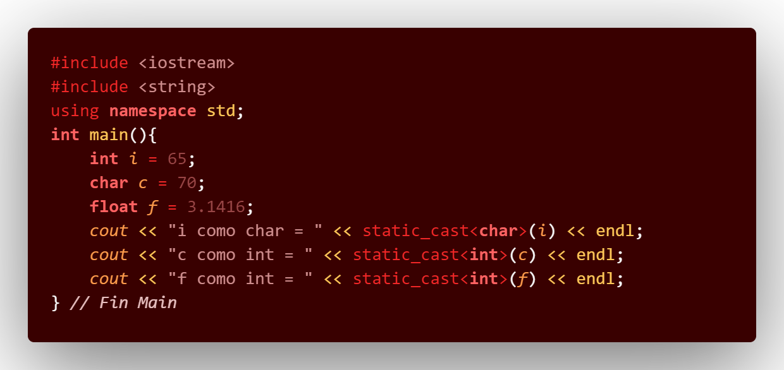

## :small_blue_diamond: Salida - Static_Cast

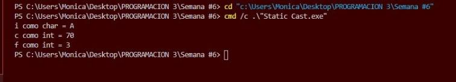

---

## :brown_circle: Static_Cast vs Dynamic_Cast 1/3

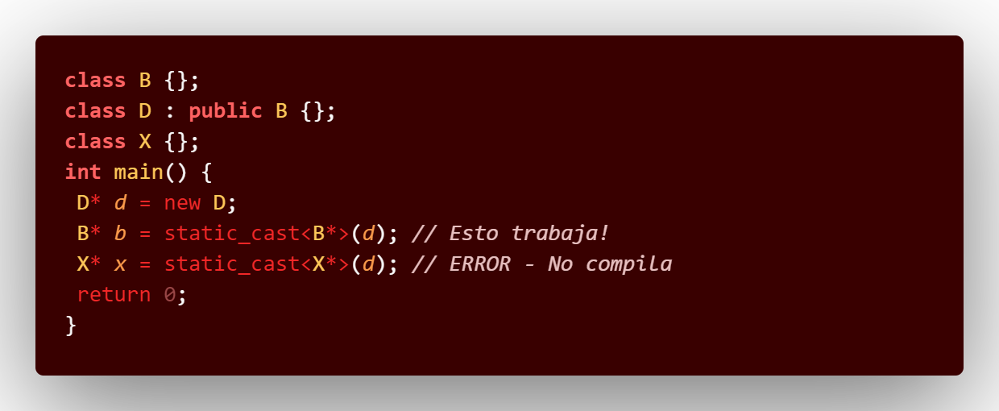

## :small_blue_diamond: Salida - Static_Cast vs Dynamic_Cast 1/3

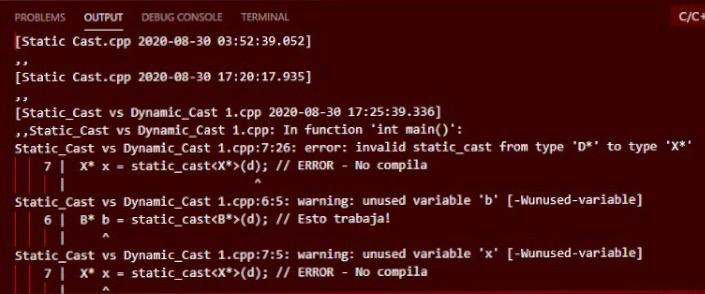

---

## :purple_circle: Static_Cast vs Dynamic_Cast 2/3

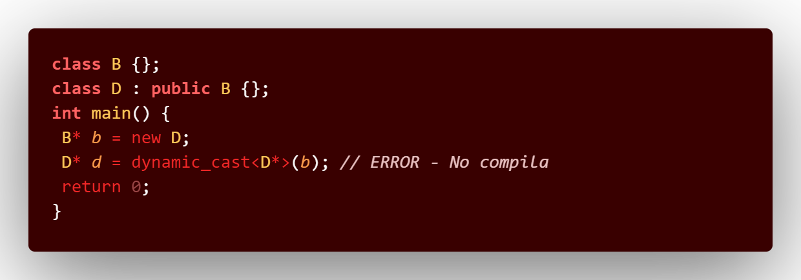

## :small_blue_diamond: Salida - Static_Cast vs Dynamic_Cast 2/3

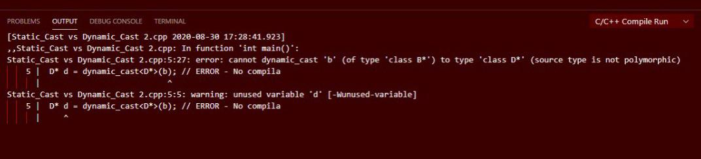

---

## :yellow_circle: Static_Cast vs Dynamic_Cast 3/3

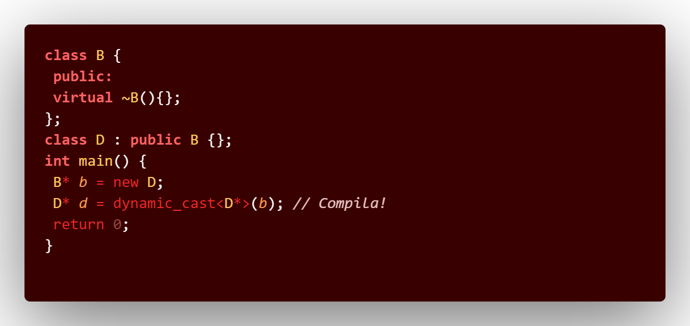

---

##  :orange_circle:  Funciones Virtuales

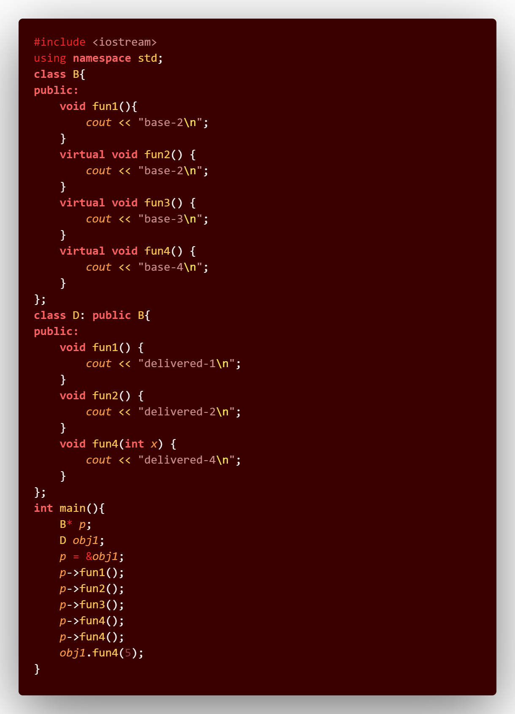

## :small_blue_diamond: Salida - Funciones Virtuales

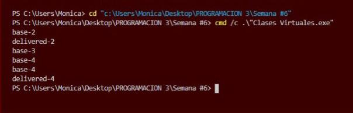

---

## :green_circle: Typeid

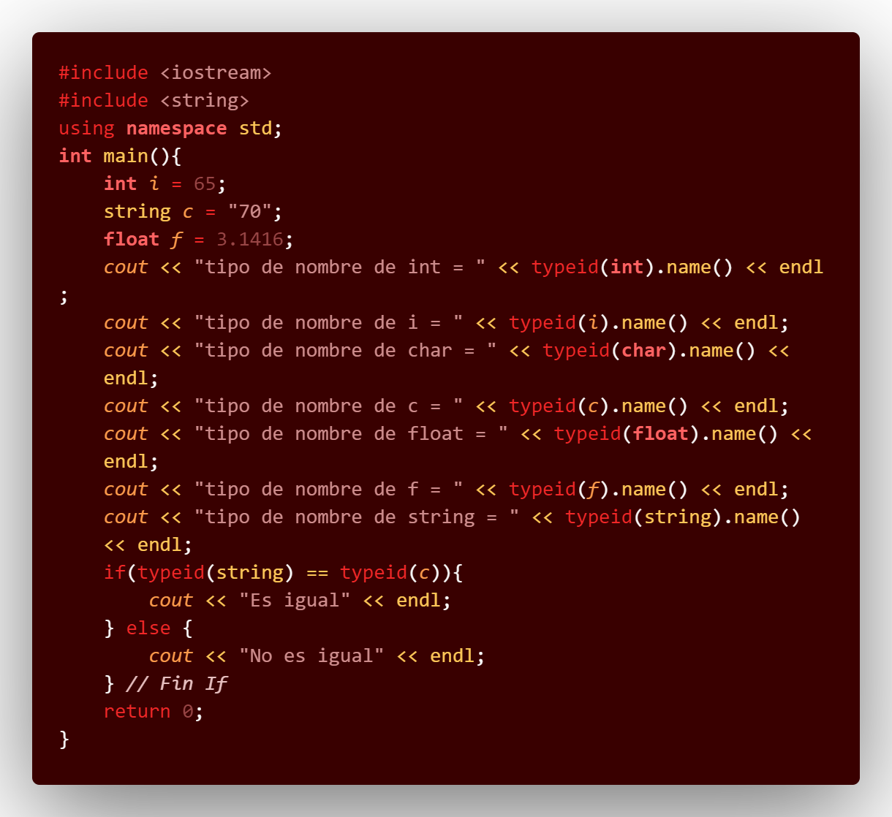

## :small_blue_diamond: Salida - Typeid

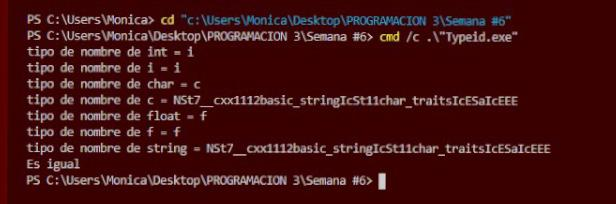

---

## :large_blue_circle: Sobrecarga de Operadores 1

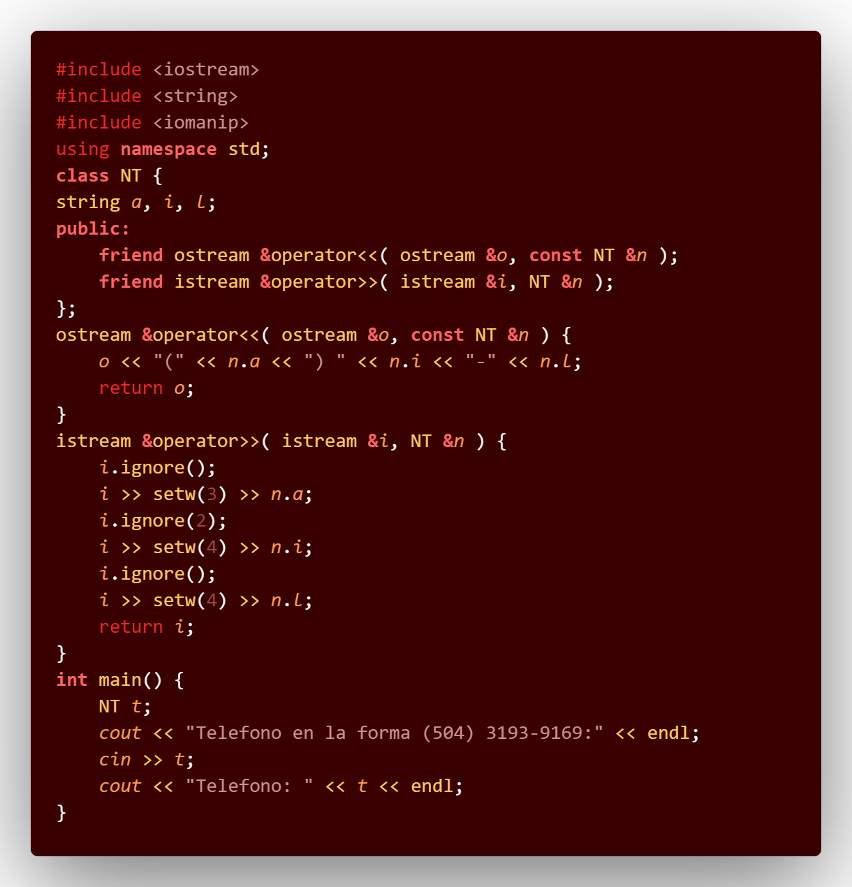

## :small_blue_diamond: Salida - Sobrecarga de Operadores 1

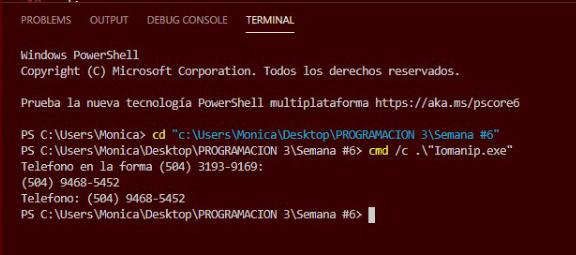

---

## :red_circle: Sobrecarga de Operadores 2

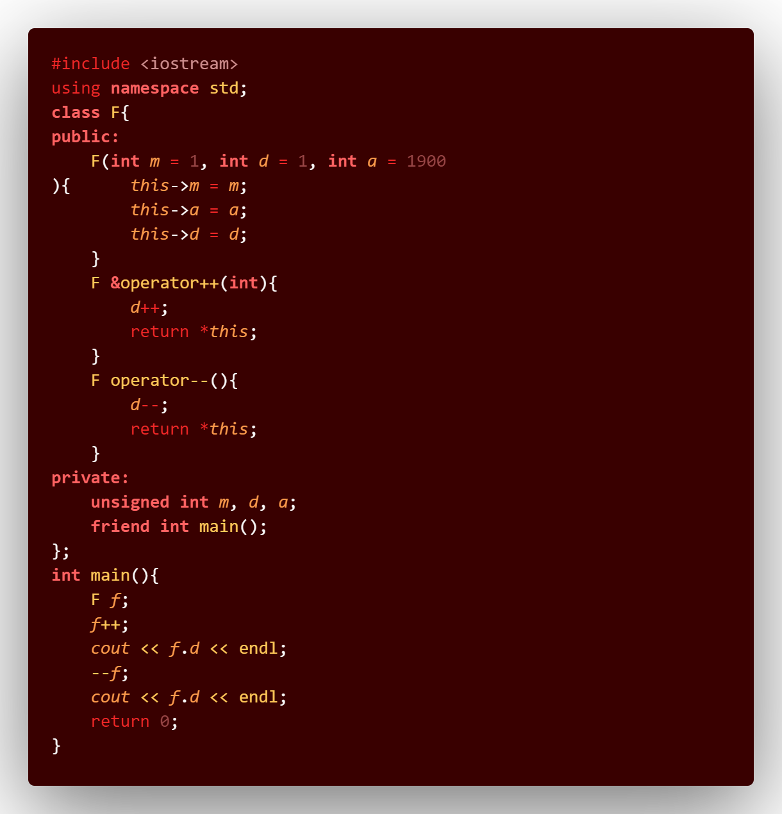

## :small_blue_diamond: Salida - Sobrecarga de Operadores 2

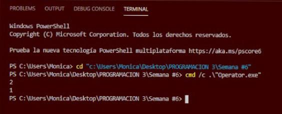

---
